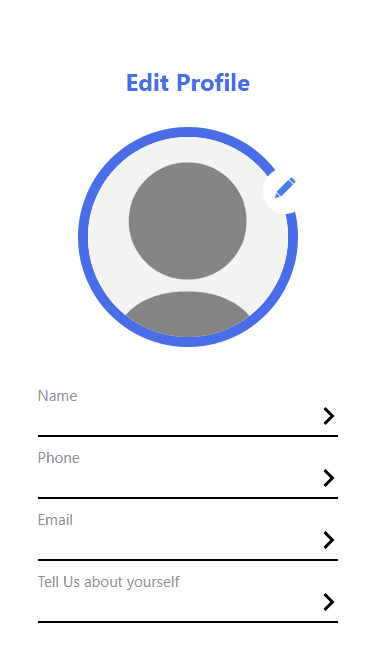

  

# Edit Profile Application

## Application Preview

## Directory:
<!-- Disabled until SPA workaround is found
* [Link](https://ahmed-sajjad111.github.io/profile-editor/) -->
* [Usage](#usage)
* [Features](#features)
* [Technologies](#technologies-and-frameworks)

## Description: 
A simple front-end profile editor that retains the information the user inputs until page restart/refresh. 

## Usage:
<!-- Disabled until SPA workaround is found
To use the site on the deployed site click on the link in the [Link](#heroku-link) section -->

To run the site locally, clone and run `npm install` followed by `npm run start`

## Features:
- Ability to edit profile picture
- Ability to edit first and last name, phone number, and email
- Ability to edit description about self

## Technologies And Frameworks:
- JavaScript
- HTML
- CSS
- Node
- React
- React Router

## Contributors, Sept 2022:
[Ahmed Sajjad](https://github.com/Ahmed-Sajjad111)

## Questions? Contact Me!:
[Contact Me](mailto:uasajjad11198@gmail.com)